# AsylDB
Eine Datenbank zur Fähigkeitsförderung von Flüchtlingen im Landkreis Kassel.


## Inhaltsverzeichnis
1. **[Einleitung](#Einleitung)**
2. **[Funktionalität](#Funktionalität)**
3. **[Code](#Code)**
4. **[Wartung](#Wartung)**
5. **[Zukunft](#Zukunft)**

<a name="Einleitung"></a>

## Einleitung
Die **AsylDB** entstand zum größten Teil im Rahmen eines Bundesfreiwilligendienstes beim Landkreis Kassel. Sie soll die Informationsbrücke zwischen dem Landkreis Kassel und dem Jobcenter bilden. Ohne deren Existenz würden für die Vermittlung hilfreiche Informationen über die Fähigkeiten von Asylbewerbern beim Zuständigkeitswechsel verloren gehen.

Die Initiative für dieses Projekt setzte Ehrenamtskoordinator **Wolfgang Engelmohr**, der auch einen ersten Prototypen bereitstellte. Innerhalb von acht Monaten (01/17 - 08/17) arbeitete **Jonas Thelemann** diese Grundidee bis hin zu einer sehr umfangreichen Form mit überaus zahlreichen Funktionen aus. Für den weiteren Support steht **Peter Brockmann** zur Verfügung. Der nächste Bundesfreiwilligendienstler **Luca Reining** wird die Datensätze pflegen.

<a name="Funktionalität"></a>

## Funktionalität
Im Hauptmenü der **AsylDB** stehen drei Bereiche zur Auswahl:

- **Daten**
- **Blankoformulare**
- **Statistikformulare**


### Daten
In der **Daten**-Ansicht stehen alle Möglichkeiten zur Datensatzpflege bereit. In der Kopfzeile befinden sich mehrere Elemente:

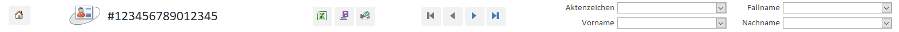

1. **Bereich**
    - Ein Button zur Navigation zurück ins Hauptmenü
2. **Bereich**
    - Die ID des aktuellen Datensatzes
3. **Bereich**
    - Ein Button für den Import eines neuen Datensatzes aus einer Excel-Quellliste
    - Ein Button zum Speichern der aktuellen Änderungen
    - Ein Button zum Druck des aktuellen Datensatzes
4. **Bereich**
    - Mehrere Buttons zur Datensatznavigation:
      - Zum ersten Datensatz
      - Zum vorherigen Datensatz
      - Zum nächsten Datensatz
      - Zum letzten Datensatz
5. **Bereich**
    - Mehrere Dropdowns zur Datensatznavigation:
      - Zum Aktenzeichen
      - Zum Fallnamen
      - Zum Vornamen
      - Zum Nachnamen

Darunter befindet sich eine Zeile mit den Hauptdaten zu einer Person.

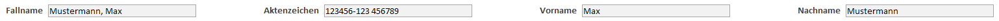

Zuletzt existiert ein Registersteuerelement, über das in verschiedenen Kategorien individuelle Daten zur jeweiligen Person eingetragen werden können. Unter allen Kategorien, die bearbeitet werden können, sind jeweils Notizen und Anlagen hinterlegt werden.


1. **Stammdaten**

    Hier werden nur die Daten angezeigt, die über die Excel-Importfunktion eingelesen wurden. Sie können nicht geändert werden.

    - Persönliches
        - Geburtsdatum
        - Alter
        - Geschlecht
    - Herkunft
        - Staatsangehörigkeit
    - Familiäre Situation
        - Familienstand
    - Status
        - Bezeichnung
        - Personenkreisnummer
        - Stellenbezeichnung
    - Adresse
        - Unterkunft
        - Ort
        - Adresstyp

    

2. **Sozialer Hintergrund**

    Hier sind private Daten, wie etwa Kontaktdaten, zu finden.

    - Persönliches
        - Bild
        - Telefon
        - E-Mail-Adresse
    - Soziale Situation
        - Familienangehörige in Deutschland
    - Unterkunft
        - Aufnahme in GU

    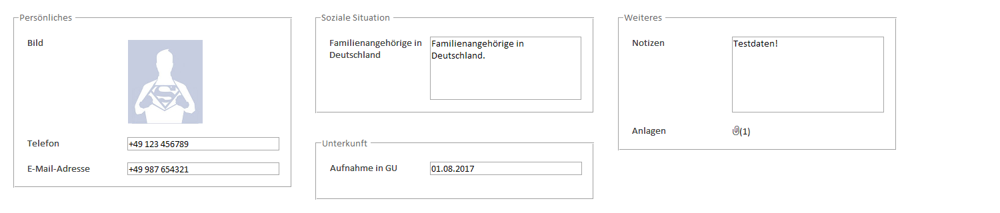

3. **Qualifikationsprofil**

    Hier werden schulische und berufliche Tätigkeiten sowie Ziele erfasst.

    - Bisheriger Bildungsweg
        - Ausland
            - ISCED-2011-Level
            - Schuljahre
            - Studienfach
            - Studienjahre
            - Berufsausbildung
            - Weiterbildung
        - Inland
            - Schulabschluss
            - Schuljahre
            - Studienfach
            - Studienjahre
            - Berufsausbildung
            - Weiterbildung
    - Berufserfahrung
        - Tätigkeiten
    - Berufliche Zukunftsvorstellungen
        - Berufswunsch
        - Berufsziel
        - Berufsplanung

    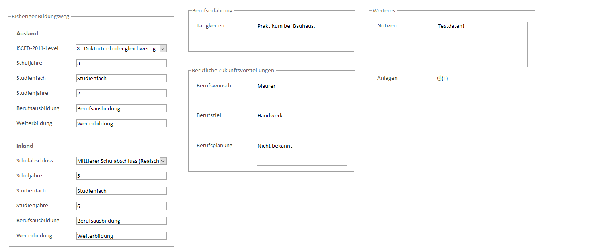

4. **Sprachkenntnisse**

    Hier können die sprachlichen Fähigkeiten und deren Ausbau in Kursen festgehalten werden.

    - Aktueller Sprachkenntnisstand
        - Muttersprache
        - Sprachkenntnisse
    - Sprachkenntniserwerb
        - Integrationskurs
            - Stufe
            - Träger
            - Beginn
            - Ende
        - Ehrenamtliche Sprachkurse
            - Kursart
            - Sprachniveau
            - Veranstalter
            - Ort
            - Zeit
            - Umfang
            - Beginn
            - Ende
        - Weitere Deutschkurse
            - Titel
            - Träger
            - Stufe
            - Beginn
            - Ende

    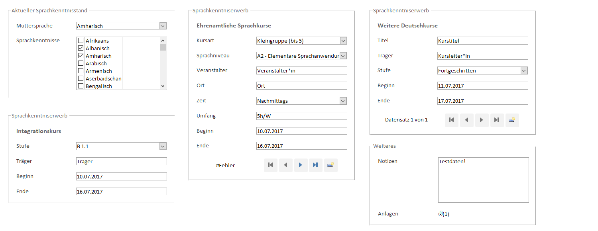

5. **Gesundheit**

    Hier befinden sich Eingabemöglichkeiten zu Beschwerdeinformationen, die (Leistungs-)Vermittelbarkeit einschränken können.

    - Basisinformationen
        - Einschränkungen
        - Beschwerden
        - Behandelnder Arzt
    - Soziale Integrationsleistungen
        - Leistungen
    - Aufenthalte
        - Stationäre Aufenthalte
    - Medizinische Maßnahmen
        - Maßnahmen
    - Persönliche Eingenschaften
        - Terminfähig
        - Integrationsangebote realisierbar
        - Vermittlungshemmnisse

    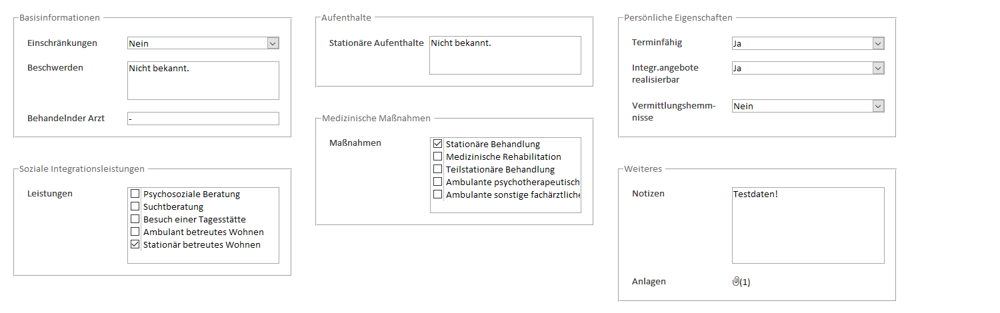

6. **Aufenthaltsstatus**

    Hier werden Anerkennung und Erwerbstätigkeitserlaubnis festgehalten.

    - Anerkennung
        - Asyl-Anerkennung
        - Aufenthaltstitel
    - Erwerbstätigkeit
        - Arbeitserlaubnis

    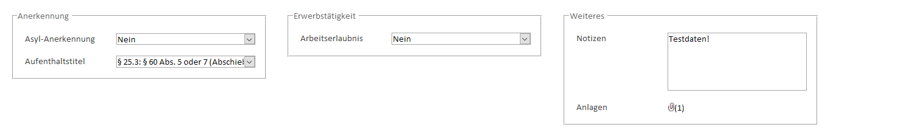

7. **Aufenthaltsverlauf**

    Hier sind vergangene und zukünftige Wohnorte einzutragen.

    - Aufenthalt und Wohnorte
        - Vorangegangene Aufenthalte
        - Zukünftige Wohnorte

    

#### Excel-Import
Mit dem **Excel-Import** können neue Stammdaten in die Datenbank geladen werden. Durch die dafür notwendigen einzelnen Schritte führt ein eigens angelegter, mehrschrittiger Dialog. Vor dem Import sollte aber unbedingt eine Sicherung des aktuellen Stands angelegt werden! Eine entsprechende Warnung wird angezeigt.

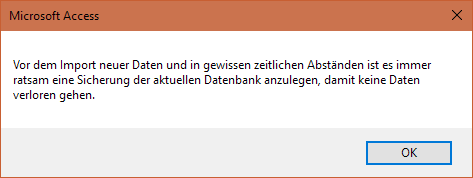

Nach jedem Schritt kann, je nach Fortschritt und Vollständigkeit der Eingaben, entweder auf **Abbrechen**, **Zurück**, **Weiter** und **Fertigstellen** geklickt werden.

1. **Quelldatenauswahl**

    Im ersten Schritt muss die Excel-Datei mit den einzufügenden Quelldaten ausgewählt werden. Nachdem die Datei angegeben wurde, wird automatisch das erste Tabellenblatt ausgewählt und die darin enthaltene Kopfzeile analysiert. In den unteren Dropdowns werden daraufhin - sofern möglich - automatisch die richtigen Werte ausgewählt. Sollte ein anderes Tabellenblatt gewünscht sein oder eine Auswahl nicht richtig gesezt worden sein, kann dies manuell korrigiert werden.

    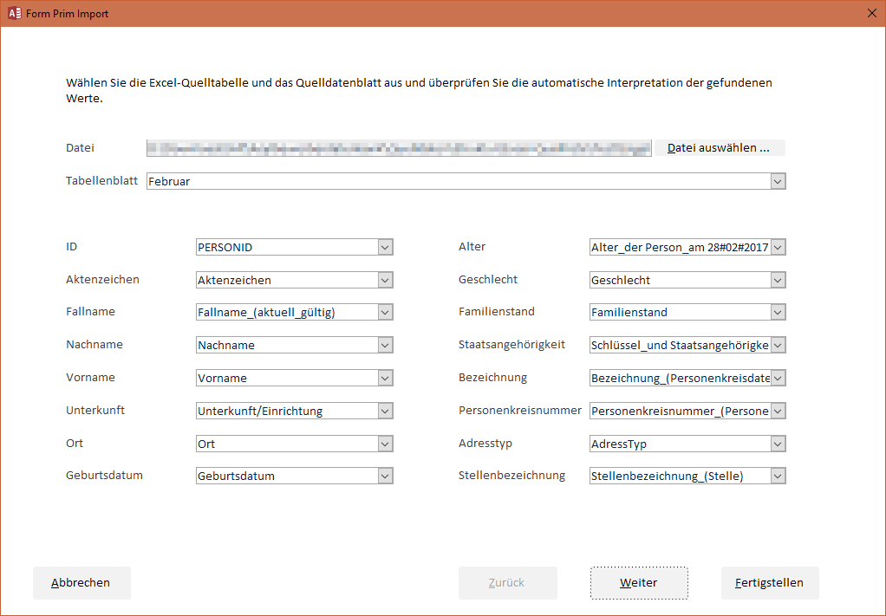

2. **Interpretation**

    Hier werden nun die erkannten und aussortierten Datensätze angezeigt, denn nicht alle Zeilen der Excel-Quelldatei müssen einen Datensatz enthalten. Die angezeigten Zeilen überprüft werden, dann kann mit dem nächsten Schritt fortgefahren werden.

    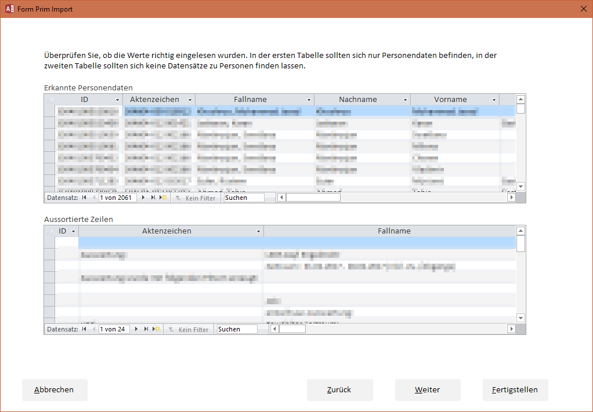

3. **Veränderungen**

    In diesen Schritt werden Veränderungen gegenüber den vorherigen Daten angezeigt. Dazu zählen:

    - Neue Daten
    - Veränderte Daten
    - Entfernte Daten

    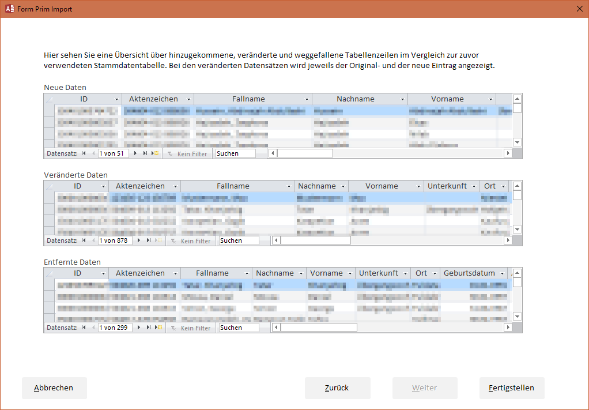

    Nach diesem Schritt ist der Assistent fertig und die Daten werden wie gewünscht importiert.

#### Ausdruck eines Berichts
Wenn ein Asylbewerber zum Jobcenter wechselt soll ihm ein Bericht über die jeweils erfassten Personendaten mitgegeben werden. Mit einem Klick auf das Druck-Symbol in der Titelleiste öffnet sich ein solcher, druckbarer Bericht. Er kann über die Tastenkombination `STRG + P` oder über das Rechtsklick-Kontextmenü gedruckt werden.

### Blankoformulare
Die Blankoformulare dienen zur Übermittlung von Einzutragenden Daten an den jeweiligen Datenpfleger beim Landkreis Kassel. Ausgefüllt werden diese Formulare in ausgedruckter Form von Institutionen wie der **VHS**.

Zu jeder Kategorie (s.o.) gibt es einen Button zur Vorschau und zum Druck. Die Kategorie **Stammdaten** kann nicht gedruckt werden, weil diese Daten nur per Excel-Tabelle importiert werden können.

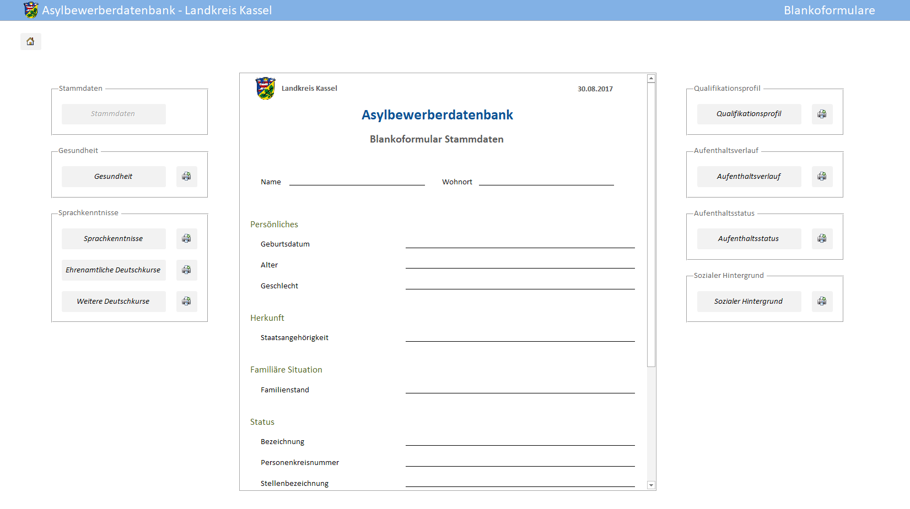

### Statistikformulare
Hier können alle Statistiken zu den eingetragenen Daten angesehen und gedruckt werden. Zum zuletzt bekannten Zeitpunkt waren aber noch keine Daten eingetragen, sodass nur Statistiken zu den Stammdaten erstellt wurden. Sie zeigen welche Möglichkeiten es bei der Erstellung von weiteren Statistiken gibt.

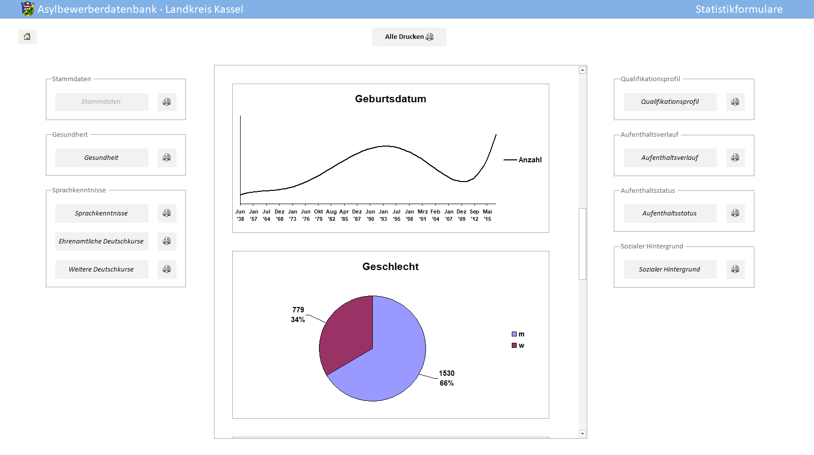

**Hinweis**  
Die im Screenshot sichtbaren Statistiken müssen nicht representativ sein!
Außerdem gilt: Für aussagekräftige Statistiken sind vollständige Datensätze nötig. Statistiken bilden ein relatives Verhältnis ab, das anderweitig nicht gegeben sein kann.

<a name="Code"></a>

## Code & Tabellen
In den Ordnern `Code` und `Tabellen` befinden sich der VBA-Code, der die erweiterte Funktionalität der Datenbank stellt, und zwei Textversionen der Datenbanktabellen: in .csv- und .md-Format. Sie sollen als Hilfestellung für eigene Projekte dienen.

<a name="Wartung"></a>

## Wartung
Sollten Fehler auftauchen oder weitere Funktionen benötigt werden, die über die bereits gegebenen, zugreifbaren hinaus gehen, sollte jemand mit tiefen Access-Kenntnissen angesprochen werden. Die Wahrscheinlichkeit ist groß, dass sonst Änderungen vorgenommen werden, die zu unbeabsichtigten Auswirkungen, wie neue Fehler, bis hin zum Datenverlust führen können.

Die Datenstruktur auf dem Server ist folgende:

```
G:\...\
└── Datenbanken\
    └── Asylbewerberdatenbank\
        ├── Ressourcen\
        │   ├── DB\
        │   │   └── AsylDB_20170818.accdb
        │   └── Icons\
        │       ├── AsylDB.jpg
        │       ├── AsylDB.png
        │       ├── AsylDB_2.jpg
        │       ├── AsylDB_2.png
        │       ├── AsylDB_2_jpg.ico
        │       ├── AsylDB_2_png.ico
        │       ├── AsylDB_jpg.ico
        │       └── AsylDB_png.ico
        └── AsylDB.lnk
```

Empfehlenswert ist von Zeit zu Zeit ein Backup der Datei `AsylDB_20170818.accdb` anzulegen. Die Datei muss auch an den die Datei Wartenden versendet werden. Besser ist es, wenn Fehler vor Ort, beim Landkreis, behoben bzw. Funktionen vor Ort hinzugefügt werden. So ist sichergestellt, dass nicht zwei Personen gleichzeitig Änderungen an derselben Datenbank vornehmen.

Der Zugriff auf Bearbeitungselemente in Access muss über einen Umweg erreicht werden: Über das Menü **Datei** > **Datenschutzoptionen** öffnet sich der Optionsdialog. Hier kann links unter **Aktuelle Datenbank** alle Einstellungen vornehmen. Zum Bearbeiten empfiehlt sich folgende Konfiguration:

- [x] Statusleiste anzeigen
- [x] Dokumentregisterkarten anzeigen
- [x] Access-Spezialtasten verwenden
- [ ] Beim Schließen komprimieren
- [x] Navigationsbereich anzeigen
- [x] Vollständige Menüs zulassen

Für normale Benutzer der Datenbank empfiehlt sich die inverse Konfiguration.

<a name="Zukunft"></a>

## Zukunft
Wie es mit der **AsylDB** und der **[EhraDB](https://github.com/dargmuesli/ehra-db)** genau weitergeht ist nicht bekannt. Ich, Jonas Thelemann, freue mich, dass ich die Datenbanken noch innerhalb meiner Dienstzeit zu meiner Zufriedenheit und der meiner Kollegen fertigstellen konnte. Da sich der gesamte Asyl-Bereich beim Landkreis aber verkleinert (positive Gründe, negative Auswirkungen), besteht die Gefahr, dass die Datenbank nicht mehr groß zur Anwendung kommt. Nichtsdestotrotz habe ich bei der Arbeit daran sehr viel gelernt und das ist, was zählt!
